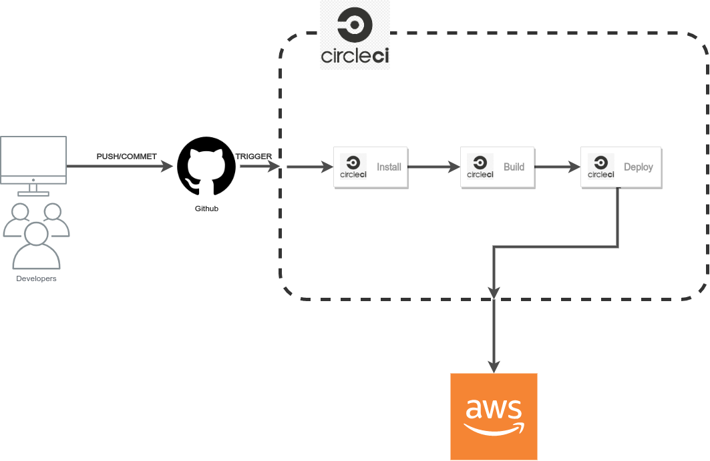

# Udagram Application Deployment

## Deploy

When a developer pushes a new commit to Udagram Application GitHub repository master branch, this will trigger CircleCI platform to deploy new Udagram Application version on our AWS cloud service.

CircleCI platform will install all the required dependencies for the Application for both Back-end and Front-end applications

Then it will build both back-end and front-end applications automatically

And the last step will be deploying both back-end and front-end applications on our AWS services.