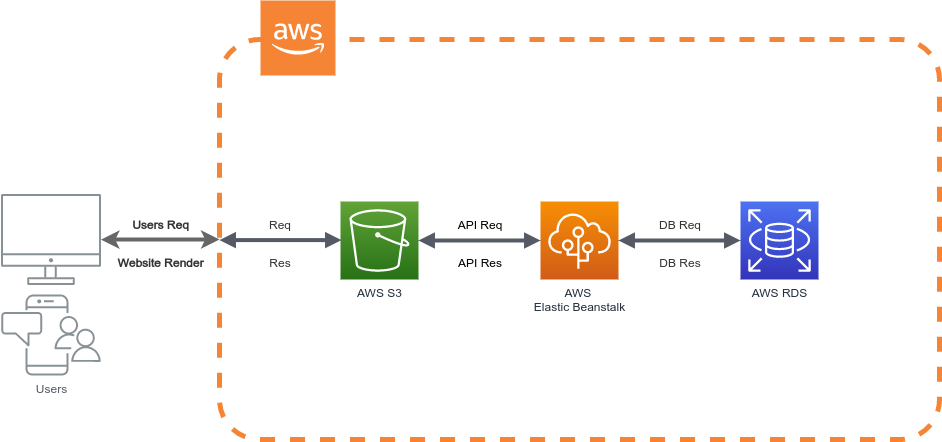

# Udagram Application Infrastructure

## AWS Cloud Services



### RDS [Relational Database Service] for the database

Udagram Application uses Postgres database using AWS RDS services

Current RDS URL: [database-1](database-1.c46aqqkmszp6.us-east-1.rds.amazonaws.com)
```
DB URL: database-1.c46aqqkmszp6.us-east-1.rds.amazonaws.com
PORT:   5432
```
### EB [Elastic Beanstalk] for the API

Udagram Application uses NodeJs Environment [Udagram-env] using AWS EB services

Current EB URL: [Back-End API](http://udagram-env.eba-ahtna7ib.us-east-1.elasticbeanstalk.com/)

```
EB URL: http://udagram-env.eba-ahtna7ib.us-east-1.elasticbeanstalk.com/
```

### S3 Bucket for web hosting

Udagram Application uses a storage service for the front-end application using AWS S3 services.

Current S3 URL: [udagram-shabana](http://udagram-shabana.s3-website-us-east-1.amazonaws.com/)

```
S3 [Front-End] URL: http://udagram-shabana.s3-website-us-east-1.amazonaws.com/
```